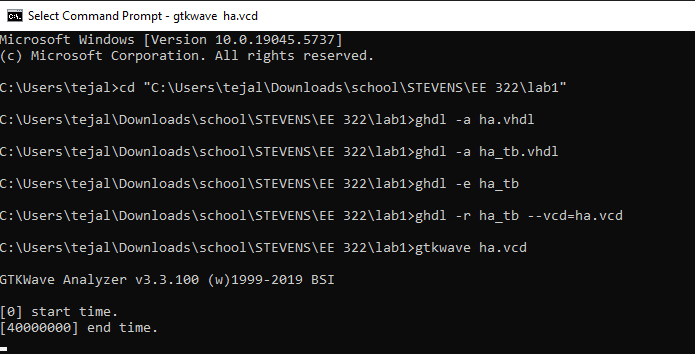
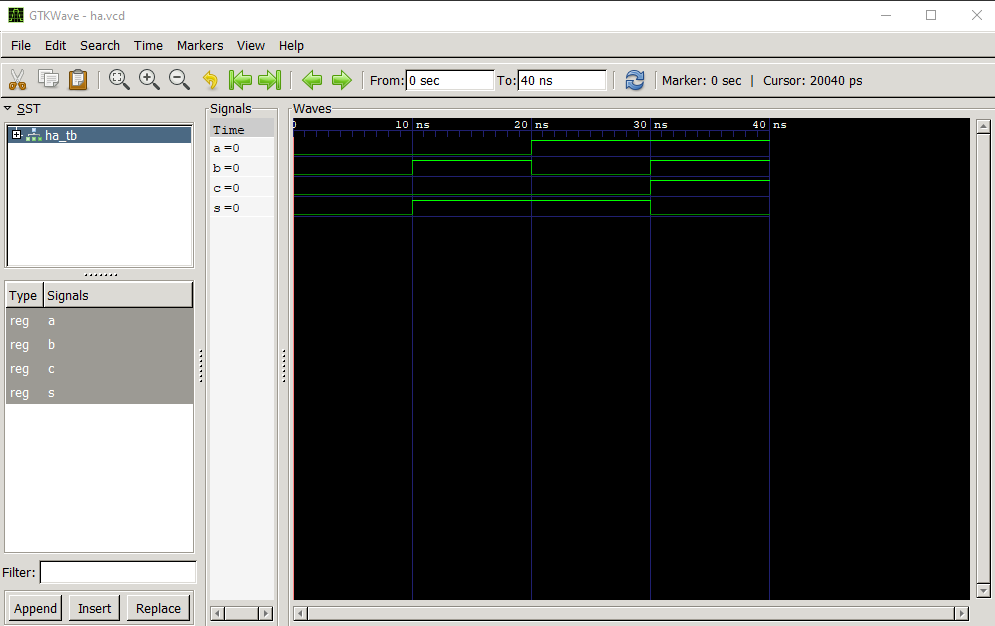
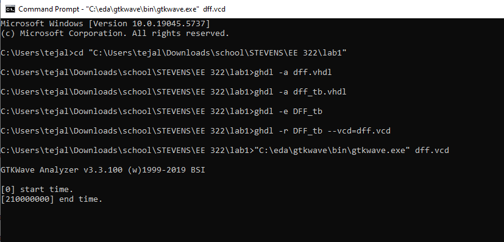
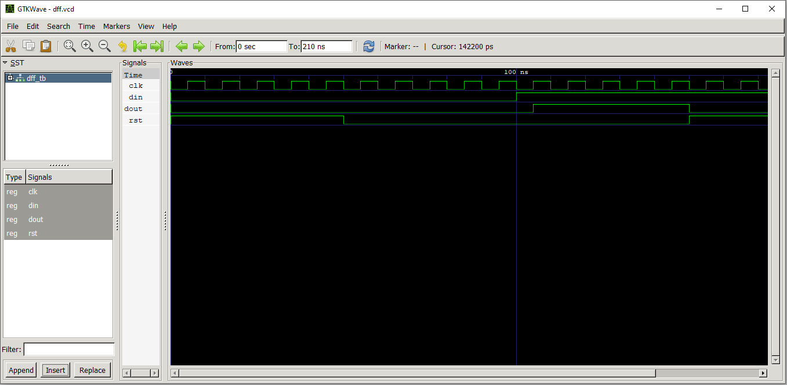

# Lab 1 — GHDL and GTKWave

##  Instructions
1. Install GHDL and GTKWave on Windows
2. Simulate the following:
  - Half Adder
  - D Flip-Flop
3. View signal results in GTKWave
4. Document results

## Half Adder

### VHDL Code

- [ha.vhdl](ha.vhdl)
- [ha_tb.vhdl](ha_tb.vhdl)

### Simulation Result

**Code Screenshot:**

**GTKWave Output:**

---

## D Flip-Flop

### VHDL Code

- [dff.vhdl](dff.vhdl)
- [dff_tb.vhdl](dff_tb.vhdl)

### 🖥Simulation Result

**Code Screenshot:**

**GTKWave Output:**

